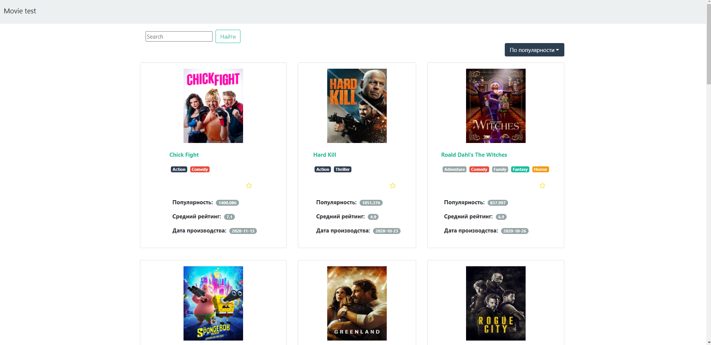
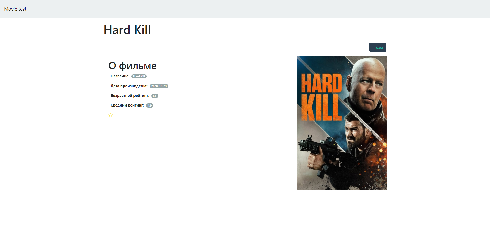

# Movie test project

## У проекта есть два роута
- Movies - Отображает весь список фильмов
- SpecificMovie - Компонент отображает конкретный фильм и информацию о нем

## Реализовано по ТЗ
- Вывод списка фильмов с изображением, названием, в избранном или нет
- Добавить карточку конкретного фильма с информацией о нем 
- Фильтрация по жанрам
- Добавить сортировку (по популярности, по рейтингу, по новизне)
- Возможность добавить фильм в избранное/удалить из избранного

## Функционал который не удалось реализовать
- Добавить в избранное и получить информацию (нет доступа с api_key)

### `yarn`
Установка всех зависимостей проекта

### `yarn start`
Запуск проекта

### `yarn build`
Запуск билда для продакшн среды

